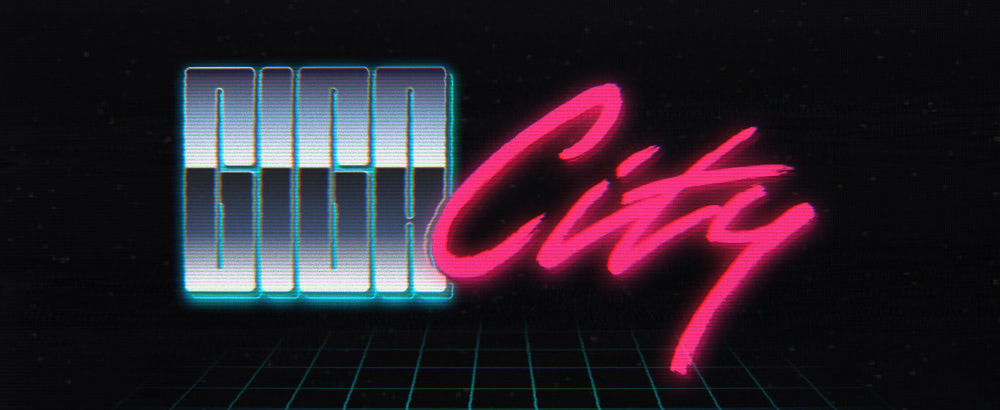

<p>
  
  <br>
</p>

# Giga City Streets

Giga City Streets contract, with 99% full test coverage. [ERC721A](https://github.com/chiru-labs/ERC721A) contract for GEN art by [0x50b](https://x.com/0x50b). Contract based off NFT project [Giga City](https://gigacity.gg), and at [@X](https://x.com/giga_city).

### Getting started

First, install the dependencies. In our case there is only a single dependency: [Foundry](https://github.com/foundry-rs/foundry). The rest is all included in the repository.

### Usage
To get the contract building.

```shell
$ forge build
```

#### Test
First command tests the contract, the second outputs the logs, and the third includes test coverage report generation.

```shell
$ forge test
$ forge test -vv
$ forge test -vv && forge coverage --report lcov
```

#### Gas Snapshots

```shell
$ forge snapshot
```

#### Deploy

```shell
$ forge script script/Counter.s.sol:CounterScript --rpc-url <your_rpc_url> --private-key <your_private_key>
```
